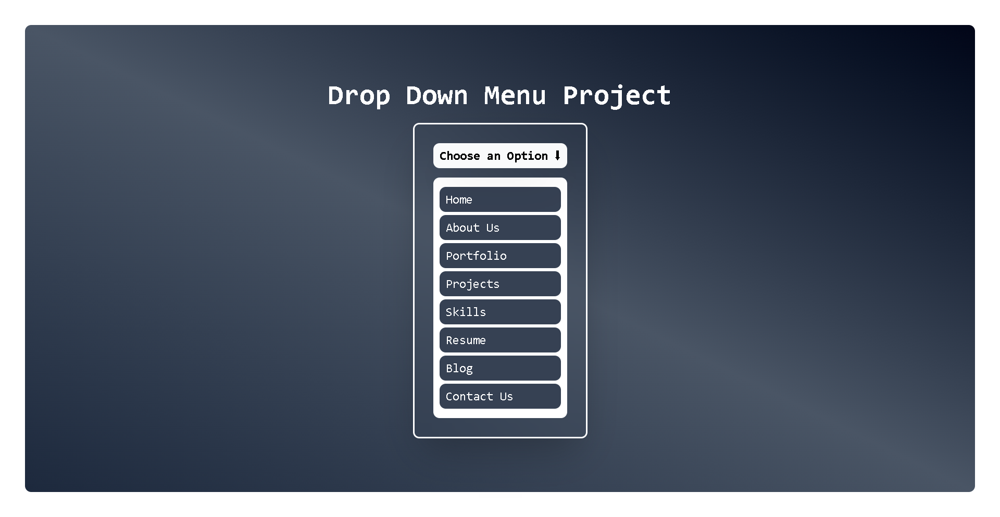

# 🎨 Dropdown Menu Project (React + Vite + Tailwind)

This project is a **beautiful and reusable Dropdown Menu** built using:

- ⚡ React (with Vite for blazing-fast dev server)
- 🎨 Tailwind CSS (modern utility-first styling)
- 🪄 React Hooks (`useState`, `useRef`, `useEffect`)

It supports:
✅ Click-to-toggle dropdown  
✅ Select an item & update the button text  
✅ Closes automatically when clicking outside  
✅ Gradient backgrounds and hover effects with Tailwind

---

## 🚀 Demo Screenshot



---

## 📂 Project Structure

dropdown-menu/
│
├── src/
│ ├── components/
│ │ └── Dropdown.jsx
│ ├── App.jsx
│ ├── main.jsx
│ └── index.css
│
├── public/
│ └── screenshot.png # (your screenshot image)
│
├── package.json
└── tailwind.config.js

---

## ⚙️ Installation & Setup

1. Clone the repository:
   ```bash
   git clone https://github.com/your-username/dropdown-menu.git
   cd dropdown-menu
   ```

---

# Install dependencies:

- npm install

- Run development server:

- npm run dev

- App will be running at 👉 http://localhost:5173

---

# 🛠️ Tech Stack

- React (Functional Components + Hooks)

- Vite (Fast bundler)

- Tailwind CSS (Styling)

- JavaScript (ES6)

---

# 🎯 Features

- Reusable Dropdown component

- Clean UI with Tailwind CSS

- Background gradient (from-slate-950 via-gray-600 to-slate-800)

- Outside click detection (closes dropdown when clicked elsewhere)

- Smooth hover effects

- Minimal & responsive design

---

# 🤝 Contributing

- Pull requests are welcome! If you’d like to improve styling, add animations, or make the dropdown multi-select, feel free to fork and submit changes.

---
